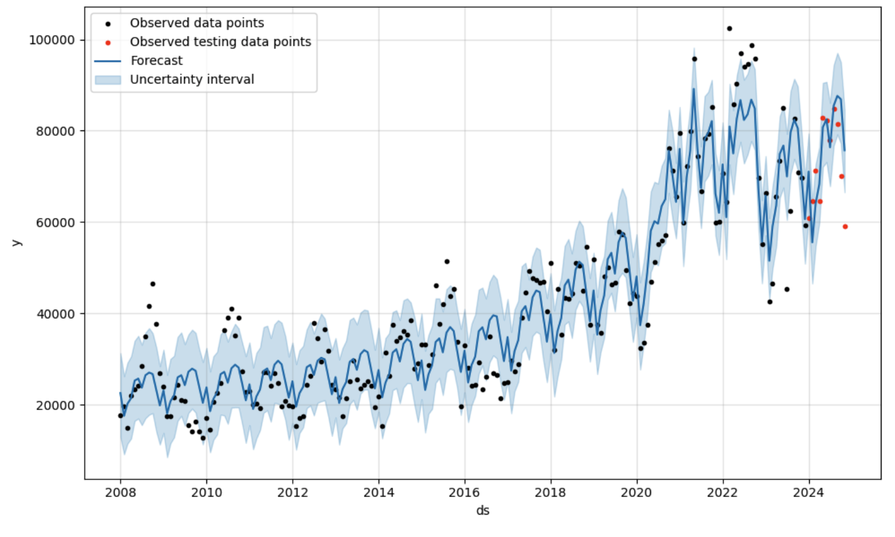
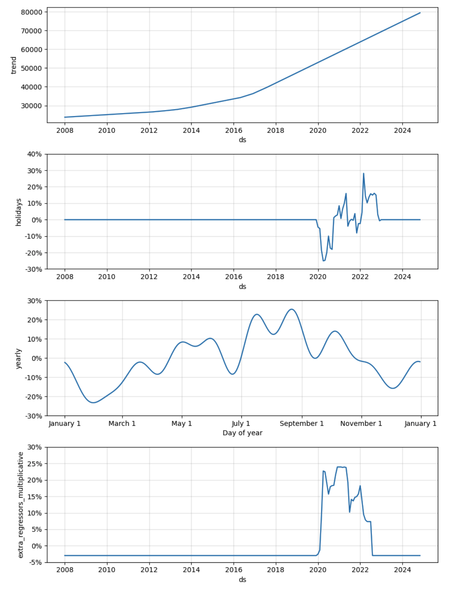
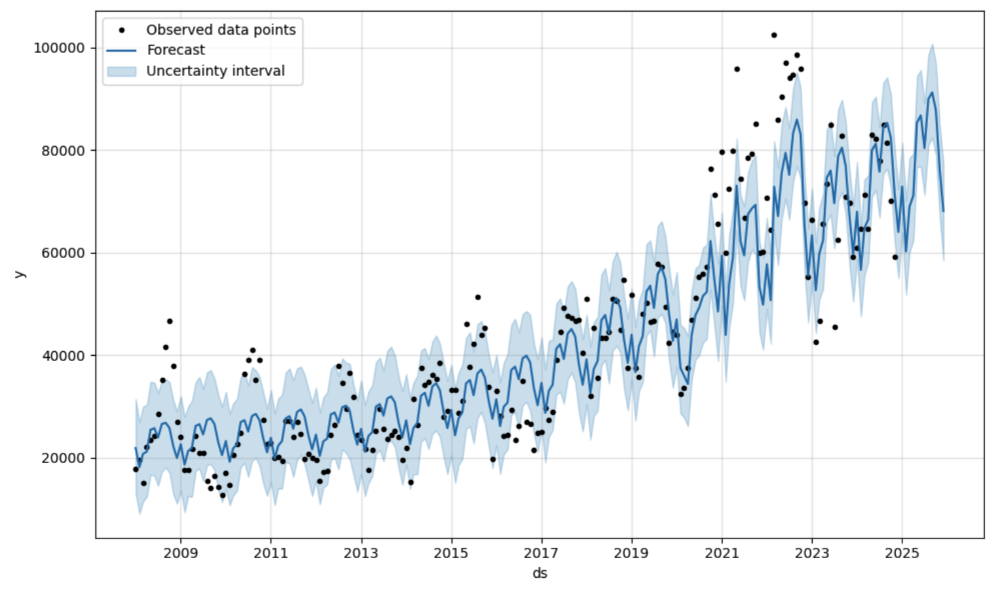

# Container_Forecast
## Introduction

**Forecasting Container Counts at the Port of Vancouver: A Data-Driven Approach to Optimize Operations and Economic Planning**

The Port of Vancouver, Canada's largest and North America's fourth largest port, serves as a critical hub for trade and economic activity. Accurate forecasting of container statistics is essential for understanding supply-demand dynamics, which are pivotal to maintaining economic balance in Canada. These forecasts directly influence the precision of weighted indices like the RWI/ISL Container Throughput Index, a key measure of global trade activity.

Moreover, reliable container forecasts enable informed decision-making in several operational and strategic areas. They support accurate revenue planning, efficient budget and resource allocation, optimized route arrangements, and early detection of shifts in trade patterns. By providing actionable insights, these forecasts empower stakeholders to adapt proactively to changes in market demand, ensuring the port's role as a cornerstone of Canadian trade and economic stability.

There are three major steps related to data in this project:
1. Cleaning data from pdf published by [Port of Vancouver](https://www.portvancouver.com/reports-and-resources).
2. Establish prophet forecasting models for metrics, including estimating the COVID-19 influence on each metric.
3. Estimate the future influence on supply and demand. Explore other possible applications (TODO).

## Tools
- [prophet](https://facebook.github.io/prophet/)
- tabula
- matplotlib

## Results
- Best model has the mininum testing mean absolute error over 12 months prediction.

- The final forecast results are listed as follows.

## TODOs
The future TODOs are about automation the forecasting to the remaining metrics, writing functions of code snippet on data cleaning and modelling, deploy an end-to-end model in any cloud platform, such as AWS or Microsoft Fabric. A draft plan is listed in the following steps:

1. Data Pipeline and Database
    - Monthly download pdf file from [Port of Vancouver](https://www.portvancouver.com/reports-and-resources)
    - Validate data according to data quality metrics
    - Automatically or mannully clean data
    - Add incremental data to database
2. Training and Forecast
    - Split the data by recent 1 year data as testing data and remaining data as training data
    - Add major events as holiday data in prior.
    - Tuning Models with parameters like model 2 and model 3
    - Find the optimal parameters
    - Training the model with optimal parameters and all testing and training data
    - Forecast the future 1 year data
    - Add prediction data to database
3. Publish and Visualization
    - Deploy monthly updated dashboard with forecasted value
    - Generate report and draw insights about the value
    - Publish dashboard

There are also other TODOs:
1. Try other modelling techniques, such as techniques shown in [Kaggle](https://www.kaggle.com/code/cabaxiom/s5e1-previous-years-baseline-no-model#Disaggregating-Total-Sales-Forecast).
2. Develop other models, such as [NeuralProphet](https://medium.com/@cuongduong_35162/facebook-prophet-in-2023-and-beyond-c5086151c138), [Explainable Forecasting at Scale](https://arxiv.org/abs/2111.15397?fbclid=IwAR2vCkHYiy5yuPPjWXpJgAJs-uD5NkH4liORt1ch4a6X_kmpMqagGtXyez4).
3. Try [model combination](https://otexts.com/fpp3/combinations.html).
4. Add analysis of predicted results, e.g., changes in [RWI/ISL container throughput index](https://www.isl.org/en/services/rwiisl-container-throughput-index).

## References
- [Container Statistics Report 2008 - 2024](https://www.portvancouver.com/media/documents/container-statistics-monthly-2008-2024)
- [Port of Vancouver 2021 Economic Impact Study](https://www.portvancouver.com/sites/default/files/2024-08/2021-Port-of-Vancouver-Economic-Impact-Study-EXEC-SUMMARY-25Jun2024.pdf)
- [2023 statistics overview](https://www.portvancouver.com/sites/default/files/2024-08/Statistics-overview-2021-to-2023.pdf)
- [Prophet - Cross Validation](https://facebook.github.io/prophet/docs/diagnostics.html#cross-validation)
- [Prophet - Additional Regressors](https://facebook.github.io/prophet/docs/seasonality,_holiday_effects,_and_regressors.html#additional-regressors)
- [Prophet - Handling Shocks](https://facebook.github.io/prophet/docs/handling_shocks.html#further-reading)
- [COVID19 Pandemic period in BC](https://en.wikipedia.org/wiki/COVID-19_pandemic_in_British_Columbia)
- [COVID19 Pandemic period in China](https://en.wikipedia.org/wiki/COVID-19_pandemic_in_mainland_China#December_2022%E2%80%93January_2023_surge)
- [Transport Canada's 2021 report](https://tc.canada.ca/en/corporate-services/transparency/briefing-documents-transport-canada/2021/current-topics/canada-s-freight-transportation-system-global-crisis-container-shipping-supply-chains)
- [COVID‑19 stringency index in Canada](https://www.bankofcanada.ca/markets/market-operations-liquidity-provision/covid-19-actions-support-economy-financial-system/covid-19-stringency-index/)
